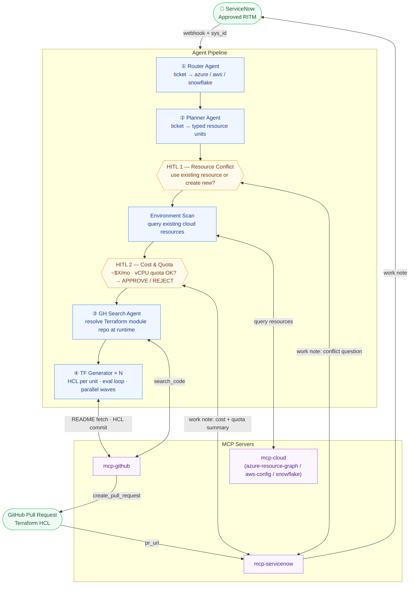
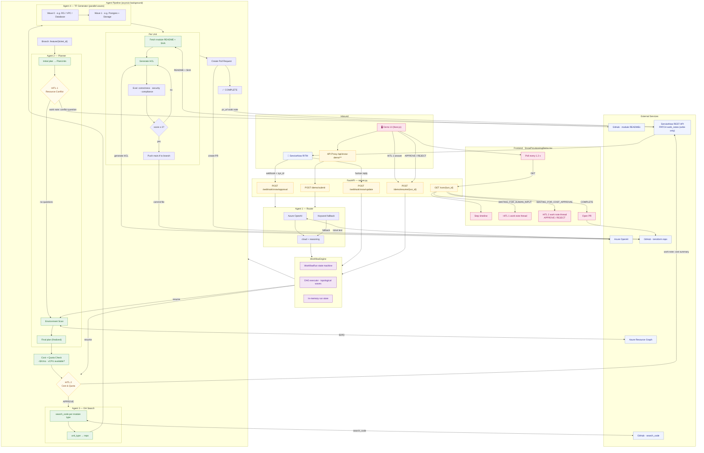

# snow-tf-platform — End-to-End Architecture

## Overview

## Detailed flow

## Component Summary

| Layer | Component | Agent? | LLM? | Notes |
|-------|-----------|--------|------|-------|
| **Ingestion** | `server.py` FastAPI | — | — | Parses webhook; passes `sys_id` from BR payload |
| **Agent 1 — Router** | `router_agent.py` | ✅ | ✅ Azure OpenAI | Reads ticket → azure / aws / snowflake; keyword fallback |
| **Agent 2 — Planner** | `planner_agent.py` | ✅ | ✅ Azure OpenAI | Ticket → typed units + dependency order + HITL 1 questions |
| **HITL 1 — Resource Conflict** | `workflow.py` step 2 | — | — | Pauses at `WAITING_FOR_HUMAN_INPUT`; human resolves existing-resource conflicts |
| **Env scan** | `environment_scan.py` | — | — | ARM Resource Graph query — deterministic, no LLM |
| **Cost + Quota** | `cost_quota.py` | — | — | Estimates monthly cost (price table) + vCPU quota (ARM API) — deterministic |
| **HITL 2 — Cost & Quota** | `workflow.py` step 5.5 | — | — | Pauses at `WAITING_FOR_COST_APPROVAL`; human APPROVE or REJECT |
| **Agent 3 — GH Search** | `github_search_agent.py` | ✅ | ✅ (ambiguous only) | Searches GitHub org at runtime to resolve repo per module type |
| **Agent 4 — TF Generator** | `terraform_agent.py` | ✅ | ✅ Azure OpenAI | README → HCL; correctness/security/compliance eval loop |
| **Evaluators** | `evaluators/*.py` | — | — | Pattern checks: correctness · security · compliance |
| **Orchestration** | `workflow_engine.py` | — | — | State machine + topological DAG sort |
| **SNOW MCP** | `mcp/servicenow.py` | — | — | Write-only — `PATCH work_notes` using `sys_id` from webhook |
| **GitHub MCP** | `mcp/github.py` | — | — | `search_code` · `get_file_contents` · `create_pull_request` |
| **Frontend** | `SnowProvisioningDemo.tsx` | — | — | 1.2 s polling · inline SNOW work note threads · eval rings |

## SNOW MCP surface

ServiceNow is only ever written to — never read. The `sys_id` arrives in the original webhook payload (`current.sys_id` from the Business Rule), eliminating any GET lookup.

| Direction | Trigger | Method |
|-----------|---------|--------|
| SNOW → platform | Approved RITM | `POST /webhook/snow/approval` |
| SNOW → platform | Human answers HITL 1 question | `POST /webhook/snow/update` (`WAITING_FOR_HUMAN_INPUT`) |
| SNOW → platform | Human approves/rejects cost | `POST /webhook/snow/update` (`WAITING_FOR_COST_APPROVAL`) |
| Platform → SNOW | Planner raises HITL 1 question | `PATCH work_notes` |
| Platform → SNOW | Cost + quota summary (HITL 2) | `PATCH work_notes` with breakdown + APPROVE/REJECT instructions |
| Platform → SNOW | Workflow complete | `PATCH work_notes` + PR URL |
